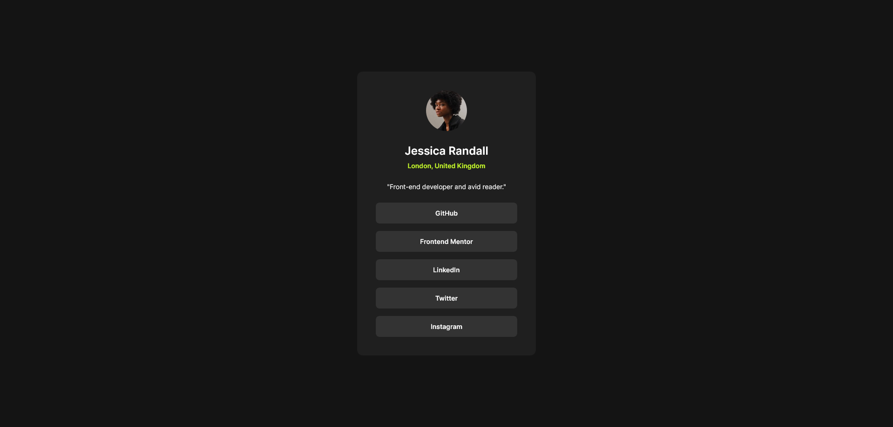

# Frontend Mentor - Blog preview card solution

This is a solution to the [Blog preview card challenge on Frontend Mentor](https://www.frontendmentor.io/challenges/social-links-profile-ckPaj01IcS). Frontend Mentor challenges help you improve your coding skills by building realistic projects. 

## Table of contents

- [Overview](#overview)
  - [The challenge](#the-challenge)
  - [Screenshot](#screenshot)
  - [Links](#links)
- [My process](#my-process)
  - [Built with](#built-with)
  - [What I learned](#what-i-learned)
  - [Useful resources](#useful-resources)
- [Author](#author)

## Overview

### The challenge

Users should be able to:

- See hover and focus states for all interactive elements on the page

### Screenshot

### Links

- [Solution URL](https://github.com/loki-pepe/social-links-profile)
- [Live Site URL](https://loki-pepe.github.io/social-links-profile/)

## My process

### Built with

- Semantic HTML5 markup
- CSS custom properties
- Mobile-first workflow

### What I learned

I learned how to make initially inert elements tabbable.

### Useful resources

- [Learn web development by web.dev](https://web.dev/learn) - Great courses for web development basics.
- [MDN Web Docs](https://developer.mozilla.org/) - An extensive resource on everything HTML and CSS.

## Author

- GitHub - [Lovro Peraić](https://github.com/loki-pepe)
- Frontend Mentor - [@loki-pepe](https://www.frontendmentor.io/profile/loki-pepe)
